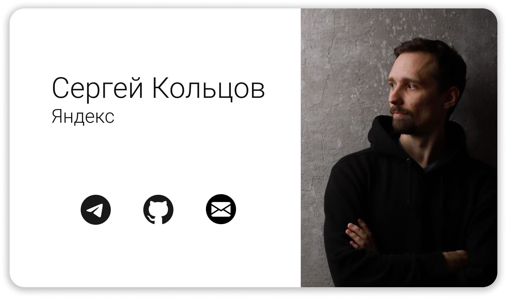

# CVApp

Простое приложение-визитка для вводной лекции по Flutter.

[Лекция на Youtube](https://www.youtube.com/watch?v=enWUtDK__hg)

[Слайды](docs/shmr_intro.pdf)

[Web](https://kltsv.github.io/cvapp/)

# Содержание

Процесс написания приложения разбит на два майлстоуна:

## 1. Работа с виджетами
[Майлстоун с пуллреквестами](https://github.com/kltsv/cvapp/milestone/1?closed=1)

1. [Верстка с помощью виджетов фреймворка](https://github.com/kltsv/cvapp/pull/1)
2. [Визуальные доработки (шрифты/иконки) и действия](https://github.com/kltsv/cvapp/pull/2)
3. [Декомпозиция UI с помощью StatelessWidget](https://github.com/kltsv/cvapp/pull/3)
4. [Реализация тёмной темы с помощью StatefulWidget](https://github.com/kltsv/cvapp/pull/4)

## 2. Начальная подготовка приложения
[Майлстоун с пуллреквестами](https://github.com/kltsv/cvapp/milestone/2?closed=1)

1. [Настройка линтера, логгера, обработки ошибок](https://github.com/kltsv/cvapp/pull/5)
2. [Интернационализация приложения](https://github.com/kltsv/cvapp/pull/6)
3. [Централизованная работа с темой приложения](https://github.com/kltsv/cvapp/pull/7)
4. [Генерация иконок](https://github.com/kltsv/cvapp/pull/8)

# Полезные материалы

* [Официальная документация Flutter](https://flutter.dev)
* [Официальная документация Dart](https://dart.dev)
* [Главное хранилище Dart/Flutter библиотек](https://pub.dev)
* [Dartpad для онлайн-экспериментов с Dart/Flutter](https://dartpad.dev)
* [Официальный Youtube-канал Flutter](https://www.youtube.com/c/flutterdev)
* [Flutter в Школе Мобильной Разработки Яндекса 2021](https://www.youtube.com/playlist?list=PLQC2_0cDcSKBB4F8y-V_lB2HiFYSWIgYW)
* [Flutter в Школе Мобильной Разработки Яндекса 2023](https://www.youtube.com/playlist?list=PLIh9yLdjK2YepDyvvvHR-_Iv_YD-W-gSP)
* [DartUp!](https://www.youtube.com/playlist?list=PLxcvsYzLfaTBFHePQCdKmZM6MCqN7OsGE)
* [Репозиторий-сборник Flutter Awesome](https://github.com/Solido/awesome-flutter) 